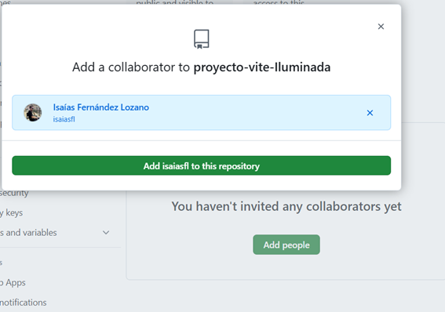
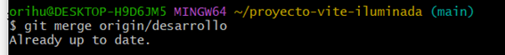

# Práctica: Introducción a Git y GitHub con Vite
## Parte 1: Configuración Inicial
Crear un nuevo repositorio en GitHub llamado "proyecto-vite-[tunombre]"

Crear un directorio local para el proyecto:

Inicializar un proyecto con Vite:

Iniciarlizar Git en el directorio local, realizando el primer commit:

Conectar el repositorio local con Github:

Crear dos ramas nuevas:
  1. Desarollo (para desarollo general)
  2. feature-ui (para cambios en la interfaz)

En la rama feature-ui:
  1.Modificar el componente principal (index.html) de Vite.
  2. Realizar al menos 2 commits significativos.

En la rama desarrollo:
  1. Añadir un nuevo componente.
  2. Realizar al menos 2 commits significativos.

Añadir colaborados al repositorio: Ir a Settings > Collaborators
Añadir al profesor usando su usuario de Github.
Añadir a un compañero usando su usuario de Github.
Aseguraarse que ambos reciben y aceptan la invitación.

Aceptar la invitación de colaboración.

Clonar el repositorio:

Crear y cambiar a una nueva rama:

Realizar modificaciones simples y concretas:
  1. Modificar el componente de navegación

  2. Añadir un nuevo botón

  3. Cambiar los estilos del header

Añadir y commitear los cambios:

Subir la rama al repositorio:

Crear el Pull request:
  1. Ir a Github

  2. Clic en "Compare & pull request"
  3. Base: esarrollo <- Compare: feature-nav-[tunombre]
  4. Titulo descriptivo
  5. Descripción detallada de los cambios realizados
  6. Asignar al propietario como reviwer
  7. Clic en "Create pull request"

Revisar el pull requests:
  1. Ir a la pestaña "Pull requests"
  2. Abrir el PR creado por el colaborador
  3. Revisar los cambios en la pestaña "Files changed"
Proponer cambios si es necesario:
  1. Añadir comentarios específicos en las líneas de código
  2. Sugerir mejoras concretas
  Ejemplo: "El color del botón podría ser más oscuro para mejorar el contraste"
Solicitar cambios o aprobar:
  1. Si requiere cambios: "Review changes" → "Request changes"
  2. Si está todo correcto: "Review changes" → "Approve"
Realizar el merge:
  1. Una vez aprobado, clic en "Merge pull request"
  2. Confirmar el merge
  3. Borrar la rama del colaborador si ya no se necesita
**Esta parte no la hice porque no me dio tiempo a contactar con ningún compañero**

Realizar merge de la rama desarrollo a main:

Resolver cualquier conficto que pueda surgir.
Realizar un push final a Github.
**No me deja porque  pone que algunos archivos de mi sistema no se pueden incluir, no sé porqué los recoge todos ni que ha pasado cuando antes funcionaba bien. Intenté hacer un commit y no me dejó. He intentado solucionarlo pero no hay forma de hallar solución, y antes de borrar todo el sistema he preferido no hacerlo.**
